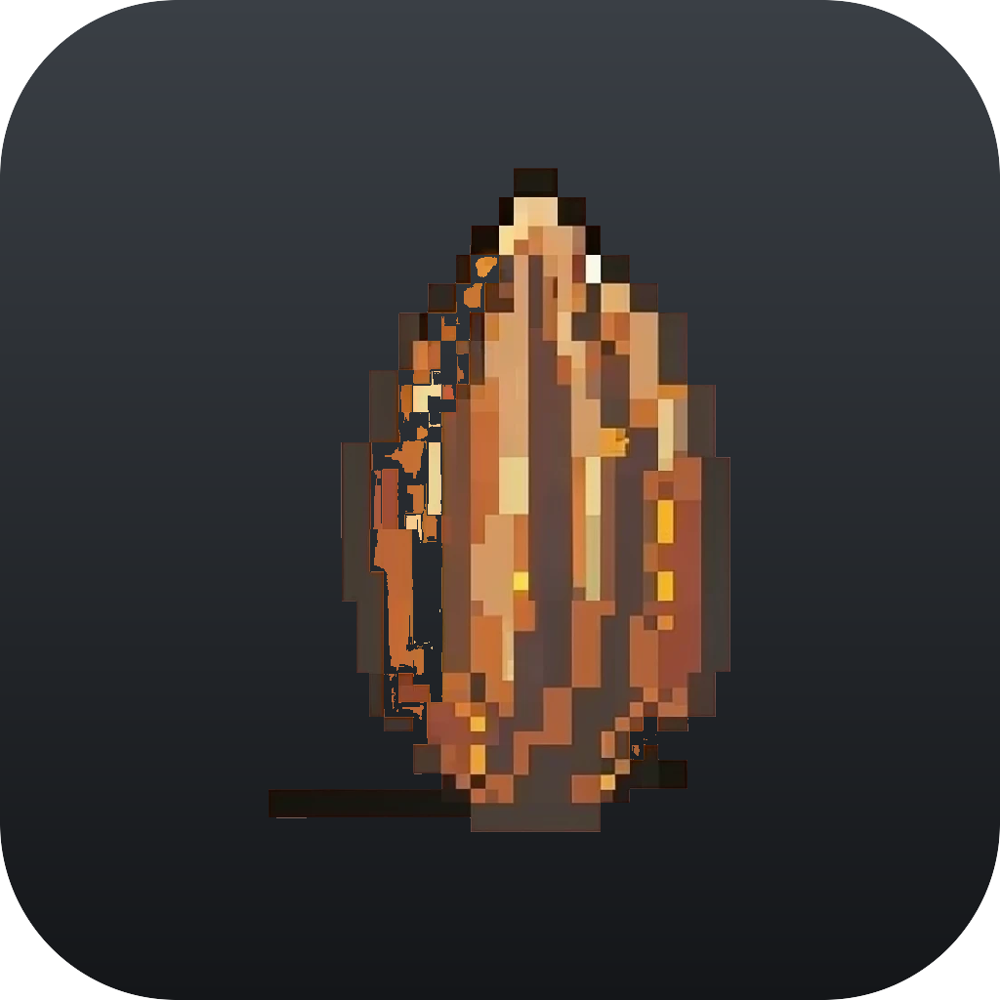

# Cabruca

Cultive cacau à sombra da Mata Atlântica e equilibre floresta, economia e comunidade em 12 dias.

**Cabruca** é um jogo *cozy* de fazenda e gestão de recursos inspirado num sistema agroflorestal real da Mata Atlântica: o cacau que cresce à sombra das árvores nativas, sem derrubar a floresta. Feito para o **Game Jam da Scienza Studio: "Aqui é BR"**.

<p align="center">
  
</p>

## Jogue agora

- **Web (HTML5):** <https://cabruca.vercel.app>
- **Downloads (desktop):** ver a [aba Releases](https://github.com/giossaurus/cabruca/releases), com versões para Windows, macOS e Linux.

## Entregável final da Game Jam

O jogo foi entregue em **duas formas**, conforme o regulamento (executável mais versão web HTML):

| Plataforma | Formato | Observação |
|---|---|---|
| Web | HTML5 estático (Vercel) | joga direto no navegador, sem instalar |
| Windows | `.exe` (instalador NSIS) mais `.zip` portátil | x64 |
| macOS | `.dmg` mais `.zip` | Apple Silicon (arm64) e Intel (x64) |
| Linux | `.AppImage` | x64, roda em qualquer distro |

Os binários desktop não são assinados: no primeiro uso, macOS (Gatekeeper) e Windows (SmartScreen) pedem confirmação para abrir.

## Objetivo

Você entra no programa +CABRUCA e tem **12 dias** para cuidar da sua terra. Não basta ganhar dinheiro: ao fim do prazo, sua fazenda terá um de três destinos, definido pelo equilíbrio de três indicadores (Biodiversidade, Economia e Comunidade):

- **Derrota:** a fazenda não resiste aos desafios;
- **Próspere:** boa produção e uma vida estável;
- **Mestre da Cabruca:** 100% do potencial, referência em produtividade, inovação e sustentabilidade.

## O segredo está na sombra

O cacaueiro é exigente com a luz. O **Nível de Sombra** de cada canteiro decide seu futuro:

- **Sol Pleno:** sem sombra, o cacau não cresce e morre em 3 dias.
- **Ideal:** o ponto certo, cresce e produz normalmente.
- **Mata Fechada:** sombra demais, cresce mais devagar.

Plante **árvores nativas** para gerar sombra e biodiversidade; **pode** as nativas quando precisar de mais produtividade (elas param de sombrear, mas rendem mais cacau por perto), sem exagerar, ou a biodiversidade despenca.

## Como jogar

- **Mover:** `WASD` ou setas (também suporta gamepad).
- **Aplicar ferramenta no canteiro:** `E` ou `Espaço`.
- **Barra de ações (teclas 1 a 6):** Nativa, Cacau, Colher, Podar, Dormir, Vender.
- Cada ação gasta **energia**; **Dormir** avança um dia (o cacau cresce conforme a sombra) e recarrega tudo.

## Recursos

- Pixel art aconchegante e trilha lo-fi relaxante
- Suporte a teclado e gamepad
- Opções de acessibilidade (anúncios para leitor de tela, ajustes de exibição)
- Personagem com apelido e pronome (ele/ela/elu)
- Salvamento automático da partida
- 100% em português

## Stack técnica

- **[Phaser](https://phaser.io/)** mais **TypeScript** mais **[Vite](https://vitejs.dev/)**
- Arquitetura core-adapter: domínio puro e testável em `src/domain` (sem Phaser) mais adapter Phaser em `src/game`
- Testes de domínio com **Vitest**
- Empacotamento desktop com **electron-builder**; deploy web na **Vercel**

```
src/
├── domain/   # regras puras: sombra, cacau, inventário, indicadores, Farm (loop de turno)
└── game/     # Phaser: cenas, HUD, hotbar, mundo, UI, áudio
```

## Desenvolvimento

```bash
npm install

npm run dev          # jogo no navegador (http://localhost:5173)
npm test             # testes de domínio (Vitest)
npm run typecheck    # checagem de tipos
npm run build        # build web de produção (dist/)

npm run electron:dev # app desktop em modo dev
```

### Gerar os executáveis

```bash
npm run dist:mac     # macOS (.dmg mais .zip, arm64 e x64)
npm run dist:win     # Windows (.exe NSIS mais .zip)
npm run dist:linux   # Linux (.AppImage)
npm run dist:all     # todas as plataformas
```

Os artefatos são gerados em `release/`.

## Créditos

Desenvolvido por Fabrine Vitória, Maria Clara Barros e Giovanni Della Dea para o Game Jam da Scienza Studio.

Assets visuais e trilha de terceiros (Farm Life Pixel Art Pack, Forest Ground Details, Phaser PixUI, Paper Themed GUI, trilha lo-fi e sons de natureza) estão creditados na tela de Créditos do jogo.
